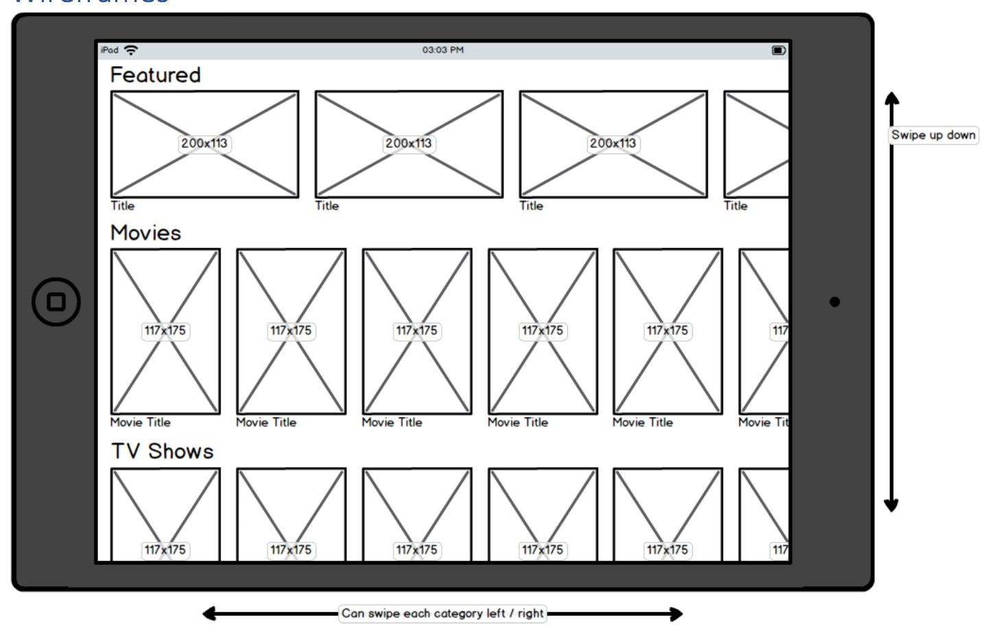
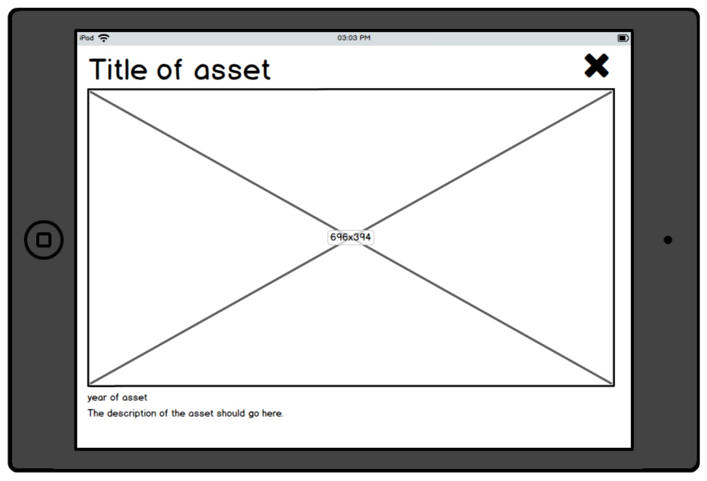

# Coding Challenge 2
# Description
Display and listing media with categories data from https://pastebin.com/raw/8LiEHfwU

## Wireframes

## Feature Requirements
✅ Implement according to the wireframes provided

✅ Single View Controller application

✅ Vertication table views

✅ Child collection views with horizontal orientation

✅ All horizontal rows must scroll independently to each other

✅ Async load data

✅ No third-party code / libries

✅ Programmatic layout (No StoryBoards or xibs)

✅ Use of AutoLayouts for layouts

✅ Include Unit Tests

## Bouns Tasks
✅ Using Swift

✅ Using MVVM over MVC pattern

✅ Clicking on a media element should animate show the detail view controller

✅ Demonstrate the good usage of Protocol Oriented Programming 

✅ Follow a coding style guide (Apple's coding style)

✅ No compiling warnings

✅ No third party library is used

✅ Mobile layout

# To Run
To run the app open it with Xcode 8.3.3. Pleaes change the "Signing" setting to your own team certificate to run the app in an real device.

# Environment
* Devices supported: iPhone and iPad
* Deploy Target: iOS 9.0 and above
* Xcode Verions: 8.3.3
* Tested Devices: iPhone 6S, iPad Air

# Unit Tests
* tested API call (files: ObjectFetchingTests.swift )
* tested images downloads  (files: CachedImageTests.swift )
* tested local image caches (files: CachedImageTests.swift )
* tested Category, Media item, Images json mapping object (files: ObjectFetchingTests.swift )

# Error Handled
* Internet connection and API calls errors
* Invalid JSON errors

# Time Logs
* Project started at Tuesday 15th Auguest 11:30 AM

# Limitations / Assumptions
* Invalid JSON data object will result hiding that data object from user. However, an error message will print in the console. This is to avoid showing multiple popup messages to user during multiple JSON errors occurred
* No manaul Accessibility added to UI elements due to the complexity of no storyboard and nib are allowed
* Media title label are max in 3 lines in the collection cell which are suitable for this demo
* For security issue, the app only allows HTTP call from thetvdb.com domain. As this demo appear to be that it only requires HTTP calls from thetvdb.com domain. For more HTTP calls to other domain please add these domains into "App Transport Security Settings" on Info.plist

# Bugs
* With the designated API url: https://pastebin.com/raw/8LiEHfwU the landscape image url https://image.tmdb.org/t/p/original/6ROakWtfAXIZCFzBsBE4Cr70urA.jpg undert "Features" -> "Veep" (first item) is an image from "West World" TV shows instead of Veep. Also under "TV Shows" -> "items" -> "Veep" (Seconds last item).

# Extra
* Thumbnail version of images are created locally for the feature image section for smoother collection view scrolling